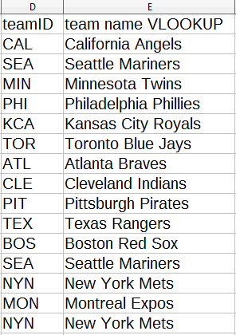
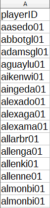

<style type="text/css">

body, td {
   font-size: 18px;
}
h1 {
  font-size: 32px;
  font-weight: bold;
}
h2 {
  font-size: 28px;
  font-weight: bold;
}
h3 {
  font-size: 24px;
  font-weight: bold;
}
h4 {
  font-size: 20px;
  font-weight: bold;
}
code.r{
  font-size: 16px;
}
pre {
  font-size: 16px
}
</style>

## 1.0 Introduction

Excel and two of its most popular free counterparts, Google Sheets and Calc, offer lookup functions and pivot tables. In this notebook we take a look at what they can do for us and what are their equivalents in R.

## 2.0 Getting some data.

I wanted to use tables from the [Lahman database](http://www.seanlahman.com/baseball-archive/statistics/), which contains Major League Baseball's statistics from 1871(!) to 2016. I downloaded the SQL database and setup a server using [XAMPP](https://en.wikipedia.org/wiki/XAMPP). After you install it, fire up the XAMPP Control Panel and start the Apache and MySQL modules.


<br>

The Lahman database is ~65 MB, so I had to change some of the settings in the php.ini file to allow for larger files to be uploaded to the server. To make the changes, click on the Config button on the Apache module row and select php.ini

Once the server is up and running, we can connect to it using R via the [RMySQL](https://cran.r-project.org/web/packages/RMySQL/RMySQL.pdf) package. Herein we load the RMySQL package, connect to the database, and list the tables in it:

```{r}
library(RMySQL)
drv <- dbDriver("MySQL")
db <- dbConnect(drv, user="root", dbname = "lahman2016", host="127.0.0.1")
dbListTables(db)
```

Using RMySQL, we can execute a SQL query and store the table it returns as a dataframe inside R. We can then take the dataframe and write it to a csv file. Let's do that with the individual batting statistics for the [1980 MLB season](http://www.espn.com/mlb/history/season/_/year/1980). 

```{r}
batting1980 <- dbGetQuery(db,"SELECT *
                              FROM Batting
                              WHERE yearID = 1980")

write.csv(batting1980, file = "batting1980.csv")
```

No output is returned, but the csv file has been written.
<br>

The batting table has two fields named playerID and teamID, which are identifiers for the players and teams rather than their actual names. The teams and the master tables have the real names along with the identifiers. We can do similarly for both of these tables. First the teams' table, filtered to include only teams that participated in the 1980 MLB season.

```{r}
teams1980 <- dbGetQuery(db,"SELECT *
                              FROM teams
                              WHERE yearID = 1980")

write.csv(teams1980, file = "teams1980.csv")
```

The master table has all the players' natural information, including first and last name, along with their identifiers. This table has *every* player that has ever played in the major leagues. There's no way to filter it by year, so we have to write the whole thing to the csv file

```{r}
master <- dbGetQuery(db,"SELECT *
                              FROM master")

write.csv(master, file = "master.csv")
```

Now we can load the tables as separate tabs in Calc.

## 3.0 Lookup functions

### 3.1 `VLOOKUP()`

Like Excel, Calcl has a [`VLOOKUP()`](https://support.office.com/en-us/article/vlookup-function-0bbc8083-26fe-4963-8ab8-93a18ad188a1) function that allows users to look for an item in a table. Its syntax is as follows:

`VLOOKUP(lookup_value, lookup_range, return_value, match_type)`

- `lookup_value` Required. *What* you are looking for.
- `lookup_range` Required. *Where* you want to look for it, i.e., a table.
- `return_value` Required. What you want *returned*, that is, the column value in the `lookup_range` you want returned. It is a number, so if the `lookup_range` has 4 columns and you want the 3rd column returned, you would put 3 in your return value.
- `match_type` Optional. `TRUE` (default) if you are ok with a partial match, or `FALSE` if only an exact match will do. I think we would almost always want `FALSE`, i.e., an exact match.

<br>

Here are relevant segments of the batting table (left) and the teams table (right)

 \ \ \ \ \ \ \ \ \ \ 

We use `VLOOKUP()` to look up the teamID (in the "D"" column in the batting table) in the relevant portion of the teams table (columns "D" through "AP"), and return the teams' names, the 39th column("AP"), counting from the "D"" column.

`=VLOOKUP(D2, Teams.$D$2:$AP$27,39, 0)`

and get:



### 3.2 `INDEX-MATCH`

`VLOOKUP()` works ok, but it has two disadvantages: it's slow, and it only searches for `lookup_value` in the leftmost column of `lookup_range`. We overcome both of these limitations by combining `INDEX()` and `MATCH()`.

#### 3.2.1 `MATCH()`

Let's look at the syntax for `MATCH()`

`MATCH(lookup_value, lookup_range, match_type) `

Searches for lookup_value and returns the relative position of the item in the lookup_range.

- `lookup_value` Required. What you are looking for.

- `lookup_range` Required. Where you want to look for it. It has to be a column or a row.

- `match_type` Optional. Similarly to `VLOOKUP()`, `1` (default), if you are ok with partial matches, or `0` if you want an exact match. There’s also a -1 option that returns the position of the smallest value that is greater or equal than the lookup_value.

If `lookup_range` is a column, `MATCH()` returns the row number where `lookup_value` was found.

#### 3.2.2 `INDEX()`

Now let's take a look at the syntax for `INDEX()`.

`INDEX(lookup_range, row_num, column_num)`

- `lookup_range` Required. Where you want to look for it, i.e., a table.

- `row_num` Required (if `column_num` is omitted). Selects the row in the lookup_range from which to return a value. If row_num is omitted, then column_num is required.

- `column_num` Required (if `row_num` is omitted). Selects the column in the lookup_range from which to return a value. If column_num is omitted, then row_num is required.

- If the array has more than one column and more than one row, and only row_num or column_num is used, INDEX()returns an array of an entire row or column, and places it in the cell. 

`INDEX()` returns the item located at (`row_num`, `column_num`) in the `lookup_range`.

#### 3.2.3 `INDEX-MATCH` combo

`INDEX()` can be used in conjunction with `MATCH()` as a faster, less limited alternative to `VLOOKUP()` by using `MATCH()` as the row_num argument of `INDEX()`.

Here are again the relevant segments of the batting table (left) and the teams table (right)

 \ \ \ \ \ \ \ \ \ \ 

We can use `MATCH()` to find the row number where the teamID is found in the teams table, and then use that as the `row_num` parameter of `INDEX()`.

`=INDEX(Teams.$D$2:$AP$27,MATCH(D2,Teams.$D$2:$D$27,0), 39)`

and get:


<br>


Now use `INDEX-MATCH` to find the players' full names using the players' playerID fields in the batting table.

Here are the relevant segments of the batting table (left) and the master table (right)

 \ \ \ \ \ \ \ \ \ \ 

Here's the `INDEX-MATCH` index for the player's last name:

`=INDEX(Master.$B$2:$P$19106,MATCH(A2,Master.$B$2:$B$19106,0), 14)`

In this case, `MATCH()` returns the row number in the master table where the playerID was found. That row number is used as the `row_num` argument in `INDEX()`, which returns the value in the 14th column in the lookup range.

For the player's first name, we simply change 14 to 15:

`=INDEX(Master.$B$2:$P$19106,MATCH(A2,Master.$B$2:$B$19106,0), 15)`

Result:


### 3.3 Lookup in R

The easisest way to [do lookups in R](https://stackoverflow.com/questions/15303283/how-to-do-vlookup-and-fill-down-like-in-excel-in-r?noredirect=1&lq=1), if you are familiar with SQL, might be to use the [sqldf package](https://cran.r-project.org/web/packages/sqldf/sqldf.pdf). To look up the teams' names on the teams1980 table, we can do an [inner join](https://www.w3schools.com/sql/sql_join_inner.asp) on `teamID` between batting1980 and teams1980.

```{r}
library(sqldf)
# Doing a lookup in R via a JOIN of batting1980 and teams1980 ON teamID
batting1980_join <- sqldf("SELECT batting1980.*, teams1980.name AS teamName
                           FROM batting1980
                           JOIN teams1980
                           ON batting1980.teamID = teams1980.teamID")
```

We can also do it using [`merge()`](# Doing a lookup in R via a JOIN of batting1980 and teams1980 ON teamID), and then we wouln't have to bring in any external libraries. 

```{r}
# https://stackoverflow.com/questions/24191497/left-join-only-selected-columns-in-r-with-the-merge-function
batting1980_join_merge <- merge(x = batting1980, y = teams1980[, c("teamID", "name")], by = "teamID")
# If we want to change the column "name" to "teamName" like we did above, 
# we have to do it separately, which is a bit cumbersome
# http://www.cookbook-r.com/Manipulating_data/Renaming_columns_in_a_data_frame/
names(batting1980_join_merge)[names(batting1980_join_merge) == "name"] <- "teamName"
```


Looking up the players' full names in the master table using `sqldf()`:

```{r}
# Doing a lookup in R via a JOIN of batting1980 and master ON playerID
batting1980_join <- sqldf("SELECT batting1980_join.*, CONCAT(nameFirst, ' ', nameLast) AS fullName
                           FROM batting1980_join
                           JOIN master
                           ON batting1980_join.playerID = master.playerID")
```

We can do it using `merge()` as well, it just takes a couple more steps to do the same thing:

```{r}
batting1980_join_merge <- merge(x = batting1980_join_merge, y = master[, c("playerID", "nameFirst", "nameLast")], by = "playerID")
# Creating the full name column
batting1980_join_merge$fullName <- paste(batting1980_join_merge$nameFirst, batting1980_join_merge$nameLast, sep = " ")
# Removing the separate nameFirst and Last columns
batting1980_join_merge <- within(batting1980_join_merge, rm(nameFirst, nameLast))
```


## 4.0 Pivot tables

### 4.1 Basics

[Pivot tables](https://support.office.com/en-us/article/create-a-pivottable-to-analyze-worksheet-data-a9a84538-bfe9-40a9-a8e9-f99134456576) allow us to "summarize, analyze, explore, and present" our data. Let's take the batting table again. Suppose we want to find out how many home runs each team hit in 1980. Calc can group the players by team and sum up the number of home runs. Here's the relevant data we would use for the pivot table.


<br>

After we select the data, we go to the "Data" menu and click on "Pivot Table -> Create..."". The following dialog box pops up:


<br>

I have selected the team names as the rows and SUM of home runs as the fields. Here is a section of the resulting pivot table:


<br>

So it has computed the total home runs by team. Note that you can edit the layout of a pivot table by right-clicking anywhere inside it and selecting "Edit Layout...". 

We can click on the "Filter" button to select only some of the teams. For example, we can tell it to show only American League teams:


and the result:


<br>

### 4.2 Multiple row fields

We can also group at a higher hierarchy level by "stacking" fields in the Rows section of the layout. For example, we can group the teams by league:


resulting in:


<br>

### 4.3 Using the columns field

What if we want to sum home runs by teams and nationalities? We would put the teams (and the leagues, too, while we are at it) in the Rows field as before, then we put the players' nationalities in the Columns field of the pivot table. First we have to bring over the players' countries of birth from the master table (right) into the batting table (left), once again using `INDEX-MATCH`.

 \ \ \ \ \ \ \ \ \ \ 

The syntax is:

`=INDEX(Master.$B$2:$P$19106,MATCH(A2,Master.$B$2:$B$19106,0), 5)`

That is, we are bringing over the 5th column, birthCountry, from the selected range.

Now that we have the country of birth in the batting table, we can add it to the Columns section of the pivot table:


and get the home runs grouped by league, team, and country:


I have filtered out some of the countries to save space. Also not shown: the pivot table adds up totals in both directions: at the righmost end is again the total number of home runs hit by each team, and at the bottom is the number of home runs hit by American players, Cuban players, etc. Pretty cool.

### 4.4 Using COUNT

The default summarizing function is Sum, but we can use others, such as Average or Count. Suppose we want to find out how many players bat right, left, or are ambidextrous, on each team. The batting preference for each field is also in the master table (right, below), so we once again need to use `INDEX-MATCH` to bring it over to the batting table (left, below) with `INDEX-MATCH`.

 \ \ \ \ \ \ \ \ \ \ 

The syntax is:

`=INDEX(Master.$B$2:$T$19106,MATCH(A2,Master.$B$2:$B$19106,0), 19)`

That is, we are retrieving the 19th column counting from the B column, which is the T column, from the master table, and bringing it over to the batting table.

Then we set up the pivot table. We put the leagues (AL, NL) and the teams in the rows, the batting preference (Left, Right, Both) in the columns, and the COUNT of such preferences in the data field, so that Calc computes how many players bat left, right, or both, on each team.


The result:


### 4.5 Pivot tables in R

#### 4.5.1 Summing up home runs by team

In R, we can use [`tapply()`](https://www.rdocumentation.org/packages/base/versions/3.4.3/topics/tapply) to summarize variables in a dataframe. For example, we can use it to add up the number of home runs by team, as we did earlier in the spreadsheet's pivot table. 

```{r}
# To get the home run sums by team
homeruns_by_team <- tapply(batting1980_join$HR, batting1980_join$teamName, sum)
homeruns_by_team
```

We can get the result into a dataframe:

```{r}
teamNames <- names(homeruns_by_team)
# Using unname()
# https://stackoverflow.com/questions/15736719/how-do-i-extract-just-the-number-from-a-named-number-without-the-name
homeRunsByTeam <- as.vector(unname(homeruns_by_team))
homeruns_by_team_df <- data.frame("teamName" = teamNames, "HR" = homeRunsByTeam)
homeruns_by_team_df
```

Then we can do a join with the teams1980 table to get the league.

```{r}
homeruns_by_team_df_league <- sqldf("SELECT teams1980.lgID, homeruns_by_team_df.*
                                   FROM homeruns_by_team_df
                                   JOIN
                                   teams1980
                                   ON homeruns_by_team_df.teamName = teams1980.name
                                   ORDER BY teams1980.lgID")

homeruns_by_team_df_league
```

#### 4.5.2 Summing up home runs by team and country

Looking up the players' countries of origin in the master table:

```{r}
batting1980_join <- sqldf("SELECT batting1980_join.*, master.birthCountry
                           FROM batting1980_join
                           JOIN master
                           ON batting1980_join.playerID = master.playerID")
```

Tabulating home runs by country and team using `tapply()` again:

```{r}
x <- with(batting1980_join, tapply(HR, list(teamName, birthCountry), FUN=sum))
y <- as.data.frame(x)
# Converting row names to a column and removing the row names afterwards
y$teamName <- rownames(y)
rownames(y) <- NULL
# Replacing NA's with 0's. An NA means a team did not have any player of that nationality.
y[is.na(y)] <- 0
# Showing only some of them to save space
keeps <- c("teamName", "USA", "Cuba", "D.R.", "P.R.", "Panama")
y[keeps]
```

#### 4.5.3 Counting batting preferences by team

Now we can try to replicate the batting preferences pivot table we did earlier here in R. Start by looking up the players' batting preferences in the master table:

```{r}
batting1980_join <- sqldf("SELECT batting1980_join.*, master.bats
                           FROM batting1980_join
                           JOIN master
                           ON batting1980_join.playerID = master.playerID")
```

Then we can count batting preferences by team with `table()`:

```{r}
batting_pref_table <- with(batting1980_join, table(teamName, bats))
# Convert the table to dataframe
# https://stackoverflow.com/questions/10758961/how-to-convert-a-table-to-a-data-frame
batting_pref_df <- as.data.frame.matrix(batting_pref_table)
# Converting rownames (the team names) to a column, and removing the rownames
batting_pref_df$teamName <- rownames(batting_pref_df)
rownames(batting_pref_df) <- NULL
# Re-ordering columns
batting_pref_df <- batting_pref_df[c(4, 1:3)]
batting_pref_df
```


## 5.0 References

1. Hermans, Felienne. [***Data Analysis: Take It to the MAX()***](https://www.edx.org/course/data-analysis-take-it-max-delftx-ex101x-2). Spring 2015.

2. Klopfer, Ben. [***Say Goodbye to VLOOKUP, and Hello to INDEX-MATCH***](http://eimagine.com/say-goodbye-to-vlookup-and-hello-to-index-match/)

3. zx8754 and Ben. [***How to do vlookup and fill down (like in Excel) in R?***](https://stackoverflow.com/questions/15303283/how-to-do-vlookup-and-fill-down-like-in-excel-in-r?noredirect=1&lq=1)

4. Ciro Santilli 包子露宪 六四事件 法轮功 and Tatu Ulmanen. [***MySQL Select all columns from one table and some from another table***](https://stackoverflow.com/questions/3492904/mysql-select-all-columns-from-one-table-and-some-from-another-table)

5. erik. [***R Function of the Day: tapply***](https://www.r-bloggers.com/r-function-of-the-day-tapply-2/)

6. Agrawal, Abhinav. [***Programming in R - tutorial : tapply() function in R***](http://rstudio-pubs-static.s3.amazonaws.com/21347_418bc228038d4e94815018ad415bba49.html)

7. Andre Mikulec and Josh O'Brien. [***How do I extract just the number from a named number (without the name)?***](https://stackoverflow.com/questions/15736719/how-do-i-extract-just-the-number-from-a-named-number-without-the-name)

8. Btibert3 and Joris Meys. [***Drop data frame columns by name***](https://stackoverflow.com/questions/4605206/drop-data-frame-columns-by-name)

9. Jay khan and akrun. [***R table function: how to sum instead of counting?***](https://stackoverflow.com/questions/32325858/r-table-function-how-to-sum-instead-of-counting)

10. Victor Van Hee. [***How to convert a table to a data frame***](https://stackoverflow.com/questions/10758961/how-to-convert-a-table-to-a-data-frame)

11. Chang, Winston. [***Reordering the columns in a data frame***](http://www.cookbook-r.com/Manipulating_data/Reordering_the_columns_in_a_data_frame/)

12. Renato Dinhani and aL3xa. [***How do I replace NA values with zeros in an R dataframe?***](https://stackoverflow.com/questions/8161836/how-do-i-replace-na-values-with-zeros-in-an-r-dataframe)

13. Samer Nachabé and stanekam. [***Left join only selected columns in R with the merge() function***](https://stackoverflow.com/questions/24191497/left-join-only-selected-columns-in-r-with-the-merge-function)

14. Chang, Winston. [***Renaming columns in a data frame***](http://www.cookbook-r.com/Manipulating_data/Renaming_columns_in_a_data_frame/)

15. Catherine and csgillespie. [***How to merge two columns in R with a specific symbol?
***](https://stackoverflow.com/questions/5559467/how-to-merge-two-columns-in-r-with-a-specific-symbol)

16. nan and Konrad Rudolph. [***What is the difference between with and within in R?***](https://stackoverflow.com/questions/21827572/what-is-the-difference-between-with-and-within-in-r)